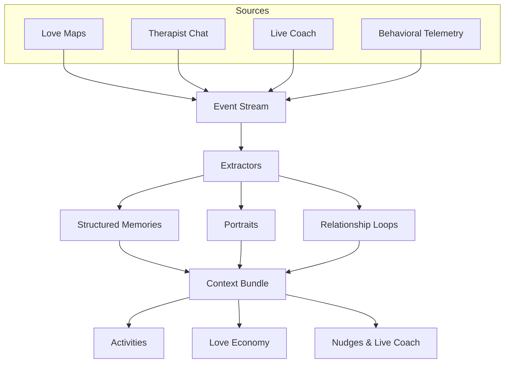
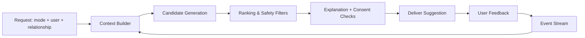

# Project Inside — Insider Compass (Dyad-first Understanding & Personalization Engine)

**Insider Compass** is Project Inside’s “Connection Intelligence” engine. It uses **Love Maps + Therapist + Live Coach + Behavioral data** to build:
1) **Structured understanding** (preferences, constraints, boundaries, goals),  
2) **Unstructured understanding** (portraits: vibe, meaning, narratives, style), and  
3) **Relationship loops** (repeatable interaction patterns: trigger → meaning → reaction → counter-reaction → outcome)

…then personalizes **Activities** (connection recipes), **Love Economy** (offers/requests), **nudges**, and **real-time coaching**, aligned with the philosophy: **Closeness over “right.”**

---

## 0) Goals and non-goals

### Goals
1. Build a **living model** of each person and each relationship (“dyad”) that improves over time.
2. Personalize across product surfaces:
   - **Activities** (partner: playful/spontaneous/silly/nostalgic; child: age-safe, attention-friendly)
   - **Love Economy** (offers/requests aligned with what each person values and can accept)
   - **Therapist** (next actions + clarification questions)
   - **Live Coach** (in-the-moment interventions that fit the person/dyad)
   - **Dashboard nudges** (timing + “small action” prompts)
3. Ensure trust via **consent, privacy, and correctability** (“What the app thinks” + confirmations).

### Non-goals
- Not a “judge” or “right/wrong” engine.
- Not surveillance: minimize raw storage; consent-first memory; avoid creepy inference.

---

## 1) Core concept: Dyad-first Connection Intelligence

Insider Compass personalizes primarily for a **pair** (user ↔ loved one), not just an individual, because Activities and Economy are inherently relational.

### Three nested models
1. **Person model** (user-level understanding)
2. **Loved-one model** (what we know about the other person; may be sparse/partial)
3. **Dyad model** (relationship-specific: what works *between these two*)

This supports:
- Partner-specific playful/spontaneous/intimate/narrative activities
- Child-specific age/attention/safety-sensitive activities
- Family/friend variants with different boundaries and logistics

---

## 2) Data sources → unified event stream

Everything enters Insider Compass as an **event**, then the engine extracts and materializes “understanding.”

### 2.1 Event sources
#### Love Maps (structured + narrative, high-signal)
- Prompt modules capturing preferences, boundaries, rituals, values, history.
- Dyad modules: “what’s fun for us,” “what’s too much,” “repair attempts.”
- Narrative prompts feed portraits and loops (see §3.3–§3.4).

#### Therapist chat (unstructured, reflective)
- Extract structured memory candidates + portrait cues + loop cues
- Propose clarification questions
- Suggest next actions (activities, economy offers/requests, nudges)

#### Live Coach (in-the-moment dynamics)
- Heat/escalation signals (sentiment slope, horsemen-style markers)
- Interaction signatures (interruptions, shutdown, reassurance seeking)
- What interventions work for this person/dyad
- Post-session summaries (prime source for loop detection)

#### Behavioral telemetry (revealed preferences)
- Activities started/completed/rated
- Economy transactions + approval friction
- Hearts/emotions sent + response latency
- Nudges accepted/dismissed

### 2.2 Event-first storage (auditable + re-runnable)
**`events`**
- `event_id`
- `type`
- `actor_user_id`
- `relationship_id` (dyad/group)
- `payload_json`
- `created_at`
- `privacy_scope` (`private | shared_with_partner | shared_with_group`)
- `source` (`love_map | therapist | live_coach | activity | economy | notification`)

Materialized views are derived from events so Insider Compass extractors can be upgraded without breaking history.

---

### 2.3 Visual overview (event → understanding → personalization)

---

## 3) Knowledge representation: Structured Memory + Portraits + Relationship Loops

Insider Compass maintains three complementary representations:

1) **Structured memories** (queryable facts/preferences/constraints)  
2) **Portraits** (unstructured “who they are” + semi-structured facets)  
3) **Relationship loops** (repeatable interaction patterns)

### 3.1 Structured memory store (queryable “facts”)
**`memories`**
- `memory_id`
- `owner_user_id`
- `relationship_id` (nullable)
- `visibility`: `private | shared_with_partner | shared_with_group`
- `memory_type`: `preference | boundary | value | goal | trigger | ritual | biography | constraint`
- `canonical_key` (e.g., `activity.playfulness`, `repair.needs_space`, `food.adventurousness`)
- `value_json`
- `confidence` (0–1)
- `status`: `hypothesis | confirmed | rejected`
- `evidence_event_ids[]`
- timestamps

**Rule:** Insider Compass uses only **confirmed** memories to drive sensitive decisions. Hypotheses require confirmation.

### 3.2 Unstructured understanding: Person & Dyad Portraits (“who they are”)
Structured fields answer “What do they like?”  
Insider Compass portraits answer “Who are they?” — narratives, vibe, meaning, identity threads, humor style.

#### 3.2.1 Person portraits
**`person_portraits`**
- `portrait_id`
- `owner_user_id`
- `relationship_id` (nullable; some portraits are dyad-contextual)
- `visibility`: `private | shared_with_partner | shared_with_group`
- `portrait_text` (100–400 words; non-judgmental)
- `portrait_facets_json` (semi-structured; see below)
- `evidence_event_ids[]`
- `confidence` (0–1)
- `updated_at`

**Portrait facets (small stable taxonomy)**
- `communication_vibe`: `direct | gentle | humorous | intellectual | emotional`
- `play_style`: `silly | competitive | cozy | adventurous | creative`
- `meaning_markers`: `nostalgia | acts_of_service | words | touch | shared_projects | quality_time`
- `identity_threads`: “builder”, “caregiver”, “explorer” (user-affirmed, non-sensitive)
- `stress_signature`: e.g., “withdraws”, “talks fast”, “needs structure”
- `repair_signature`: e.g., “needs reassurance”, “needs space then reconnect”
- `anti_patterns`: “feels unseen when interrupted”
- `symbolic_gestures`: “handwritten notes land deeply”

#### 3.2.2 Dyad portraits (relationship “vibe”)
**`dyad_portraits`**
- `dyad_portrait_id`
- `relationship_id`
- `portrait_text` (100–300 words)
- `facets_json` (dyad play profile, novelty sweet spot, repair vibe)
- `evidence_event_ids[]`
- `confidence`
- `updated_at`

Used by Insider Compass for Activities/Economy tone and framing.

### 3.3 Relationship loops (the “repeatable dance”)
A **relationship loop** is a recurring pattern:
**Trigger → Meaning → Reaction → Counter-reaction → Outcome → (repeat)**

Loops are *not blame* and *not “who’s right.”* They are the predictable interaction pattern that creates distance—so the dyad can interrupt it and return to closeness.

#### 3.3.1 Loop object
**`relationship_loops`**
- `loop_id`
- `relationship_id`
- `name` (short, non-blaming: “after-work tone → shutdown”)
- `trigger_signals_json`
  - time-of-day, topic tags, context flags (after work, parenting chaos, money talk)
- `meanings_json` (optional, careful wording)
  - “feels criticized,” “feels controlled,” “feels unseen”
- `patterns_by_person_json`
  - Person A: withdraw/defend/criticize/over-explain
  - Person B: pursue/demand reassurance/sarcasm/fix-it mode
- `heat_signature_json`
  - early indicators (interruption spike, sentiment slope, contempt markers)
- `repair_attempts_json`
  - what tends to work (pause, reassurance sentence, humor, space-then-reconnect)
- `recommended_interruptions_json`
  - best interventions for this loop (Live Coach scripts + watch nudges)
- `confidence` (0–1)
- `status`: `hypothesis | confirmed`
- `evidence_event_ids[]`
- `last_seen_at`

#### 3.3.2 Example loop templates
- “After-work criticism → shutdown → pursue”
- “Pursuer–distancer loop (talk now vs space first)”
- “Fix-it vs feelings (solutions feel invalidating)”
- “Parenting chaos → blame spiral”
- “Logistics spiral (late/night) → resentment”
- “Tone policing → defensiveness”
- “Silent treatment → escalation attempts”

### 3.4 Optional retrieval layer (unstructured summaries)
Store minimal text:
- Therapist message summaries
- Live Coach session summaries
- “why it worked” notes for activities

Use embeddings for retrieval, but Insider Compass never treats retrieved text as truth unless backed by confirmed memories or explicit user-authored Love Maps.

---

## 4) Extraction pipelines: Structured + Portrait + Loops (safe, evidence-linked)

### 4.1 Structured extraction pipeline (memories)
For each relevant event:
1. **Tag topics** (conflict, appreciation, logistics, intimacy, parenting, etc.)
2. **Extract memory candidates** (preferences, constraints, boundaries, goals)
3. **Normalize** into `canonical_key` + `value_json`
4. **Assign status**
   - Love Maps structured answers → typically `confirmed` (high confidence)
   - Therapist/Live Coach → `hypothesis` unless explicitly stated/confirmed
5. **Store evidence pointers** to event(s)

### 4.2 Portrait extraction pipeline (person_portraits, dyad_portraits)
For each Love Map narrative / therapist message / Live Coach summary:
A. Extract 1–3 **portrait candidate statements**  
B. Map into **portrait facets** when possible  
C. Refresh a short **portrait paragraph** (non-judgmental; avoids labels)  
D. Apply **confirmation rules** (see §8.2)  
E. Link `evidence_event_ids`

### 4.3 Loop extraction pipeline (relationship_loops)
Loops are extracted from repeated patterns across:
- Live Coach sessions (strongest: heat signatures + interventions + outcomes)
- Therapist narratives (“this always happens when…”)
- Love Maps conflict prompts (explicit dyad self-report)
- Behavioral telemetry (time-to-repair, repeated triggers)

**Process**
1. **Detect candidate loop**
   - recurring trigger tags + consistent reaction patterns + repeated outcomes
2. **Summarize neutrally**
   - name without blame (“after-work tone → shutdown”)
3. **Extract loop structure**
   - triggers, meanings (carefully), patterns_by_person, heat_signature
4. **Attach best interrupt + repair attempts**
   - from intervention efficacy + user confirmations
5. **Assign status**
   - `hypothesis` until confirmed (or high-confidence repeated Live Coach evidence)
6. **Confirmation prompt**
   - “Does this pattern sound familiar?” `Yes / No / Not sure`

---

## 5) Activities v2: “Connection Recipes” library + safe composer

Activities are structured experiences designed to create **spontaneity + play + meaning**, reducing heart distance.

### 5.1 Activity template library (curated backbone)
**`activity_templates`**
- `activity_id`
- `title`
- `relationship_types`: `partner | child | family | friend`
- `age_range` (child/family)
- `vibe_tags`: `silly, spontaneous, intimate, nostalgic, calm, adventurous`
- `risk_tags`: `physical, public, sexual, cost, time`
- `constraints`: duration, budget, location, materials
- `personalization_slots`: `restaurants[]`, `shared_memory`, `skills`, `inside_jokes`, `comfort_boundaries`
- `steps_markdown_template`
- `variants`: low/medium/high effort
- `safety_rules` (hard excludes; especially for children)

**Partner template examples**
- Cooking blindfolded
- Recreate first date
- “Tour de Food” (three restaurants, three courses)
- “Teach Me Something” (teach each other a skill)
- “Blanket Fort” indoor camping night
- Nerf fight → undressing (“Jack & Rose”) — **consent-gated** + private-only + safe variants

**Young child template examples**
- Petting zoo
- Scavenger hunt
- Build-a-fort
- Craft + story night

### 5.2 Dyad activity personalization (who + what + when)
Insider Compass selects activities using:
- relationship type + age constraints
- **preference overlap** (user ∩ loved one) from confirmed memories
- **portrait facets** for tone/framing/variant selection
- **loop-aware state**:
  - post-conflict → repair ladder activities
  - known triggers → avoid “risky fit” activities in sensitive windows
- constraints (time/budget/location)
- novelty balance (avoid repetition; avoid “too intense”)
- success history for this dyad

### 5.3 Loop-aware “repair ladder” activity selection
When a loop is active/recent:
1. **Reset** (1–3 min calm-down)
2. **Micro-repair** (2–5 min script, reflective summary)
3. **Gentle reconnection** (10–20 min low-pressure activity)
4. **Play/novelty** later (bigger silly activity when regulated)

### 5.4 Activity composer (safe generative layer)
When templates don’t fit, generate a new recipe by remixing:
- vibe + constraints + personalization slots + portrait facets + safety rules
- and **loop-aware constraints** (avoid high-arousal right after conflict)

Outputs:
- Title, why it fits, steps, variants, materials, safety notes, consent checks

---

## 6) Love Economy v2: “Market of Connection Acts” (loop-aware)

Economy becomes a structured way to request and offer **connection behaviors** (including activities), not just chores.

### 6.1 Two catalogs per relationship
- **Offers** (“Spend tokens to receive”): gestures, services, dates, connection acts
- **Requests/Bounties** (“Earn tokens by doing”): partner wants, including activities

### 6.2 Personalization for economy suggestions
Insider Compass suggests:
- Offers you should create (aligned to partner’s meaning markers + preferences + portraits)
- Requests you can ask for (likely welcomed / low friction)
- Fair token pricing band based on effort + dyad history + friction learning
- Tone/framing influenced by portraits (“symbolic gestures” vs “practical help”)
- **Loop-aware** suggestions:
  - if “after-work shutdown loop” → request “10-min decompression pass” + “timed reconnect”
  - if “pursuer–distancer loop” → offer “structured check-in time” tokens

### 6.3 Transaction friction learning
Detect stalls:
- too expensive, too vague, approval bottleneck
Suggest fixes:
- “Make this request more specific”
- “Lower-effort variant”
- “Pre-approve category” (trusted dyads)

---

## 7) Insider Compass personalization engine: shared pipeline for all modes

### 7.1 Context builder (“working memory”)
Input: `(mode, actor_user_id, relationship_id, now)`  
Output: `ContextBundle`:
- dyad snapshot (overlap, constraints, history)
- person snapshots (user + loved one)
- **portraits** (text + facets)
- **active loop signals**
  - recent loop matches, heat indicators, time since last conflict
- current signals (stress/closeness trend/recent heat)
- policy constraints (privacy/consent)
- recent activity/economy outcomes

### 7.2 Candidate generation by mode
- **Activities**: filter templates, optionally compose new one, apply repair ladder if loop is active
- **Economy**: generate offer/request candidates from memory keys + templates + loop-aware templates
- **Therapist**: propose next actions + confirmation prompts (memories, portraits, loops)
- **Live Coach**: choose loop-specific interruption scripts
- **Dashboard**: micro-nudges (heart/emotion/activity suggestion) timed to dyad state

### 7.3 Ranking (v1 heuristic → v2 learned)
Start with transparent scoring:

`score = preference_fit + portrait_fit + loop_fit + state_fit + constraint_fit + novelty_fit + history_fit - risk_penalty - friction_penalty`

Where:
- `preference_fit` uses confirmed memories + overlap
- `portrait_fit` uses facets to pick tone, difficulty, symbolism
- `loop_fit` avoids known triggers in sensitive windows and favors repair ladder options
- `risk_penalty` respects consent/boundaries/age safety

Upgrade later to:
- dyad-specific bandit learning (activity styles)
- pairwise ranking from feedback (thumbs up/down)

### 7.4 Explanation generator (trust layer)
Every Insider Compass suggestion includes:
- Why this fits (explicit prefs, portrait facet, loop-aware rationale)
- What to do (steps)
- Alternative option (lower effort / lower risk)
- “Edit assumptions” (tap to correct)
- Consent check when relevant

### 7.5 Request-time flow (feedback loop)

---

## 8) Consent, privacy, and safety (first-class)

### 8.1 Visibility and memory rules
- Default **private** for therapist-derived sensitive content
- Promote to shared only via explicit user action
- Live Coach transcript storage opt-in; default store only summaries/features
- Prefer storing structured facets over raw text where possible

### 8.2 Hypothesis confirmation loop (critical)
High-impact items require confirmation:
- boundaries, triggers, intimacy prefs, sensitive “anti-pattern” claims
- **relationship loops** (to avoid mislabeling)

Flow:
- Store as `hypothesis`
- Ask lightweight confirmation later:
  - “Does this pattern sound familiar: after-work criticism → shutdown → pursue?”
  - Buttons: `Yes / No / Not sure`
- If `Yes` → set `confirmed`
- If `No` → set `rejected` (and decay similar hypotheses)

### 8.3 Consent gating for intimate activities
Any “sexual/intimacy” activity:
- requires explicit opt-in tags for the dyad
- provides a non-sexual variant by default
- never implies obligation; encourages explicit consent

### 8.4 “This is how I see you” UI (editable portraits + loops)
A dyad insight screen with:
- Person portraits + dyad portrait
- Detected loops (neutral names + structure)
Actions:
- ✅ Accurate
- ✏️ Edit wording
- 🗑️ Remove
- 🔒 Keep private / Share
- “Mark as helpful repair” (teaches the model)

---

## 9) Services & APIs (clean architecture friendly)

### 9.1 Services
1. **Event Ingest Service**
   - Accepts events from all modes
   - Writes to `events`
   - Queues extraction jobs

2. **Understanding Extractor Service**
   - Parses Love Maps (structured + narrative)
   - Extracts structured memories/hypotheses from Therapist + Live Coach summaries
   - Extracts loops (`relationship_loops`)
   - Builds/updates portraits (`person_portraits`, `dyad_portraits`)
   - Materializes dyad/person/loop views

3. **Personalization & Recommendation Service**
   - Builds context bundle
   - Generates candidates
   - Ranks + explains
   - Returns mode-specific outputs

4. **Activity Library Service**
   - CRUD templates
   - Localization
   - Safety rules + consent gating metadata

5. **Economy Suggestion Service** (can be merged into recommender)
   - Offer/request templates
   - Pricing band guidance + friction fixes

### 9.2 Example endpoints
- `POST /v1/events`
- `GET /v1/recommendations?mode=activities&relationship_id=...`
- `GET /v1/recommendations?mode=economy&relationship_id=...`
- `GET /v1/recommendations?mode=dashboard&relationship_id=...`
- `GET /v1/dyads/{id}/insights` (portraits + loops + “what we think”)
- `POST /v1/memories/{id}/confirm`
- `POST /v1/loops/{id}/confirm`
- `POST /v1/memories/{id}/share`
- `POST /v1/portraits/{id}/edit`
- `POST /v1/portraits/{id}/share`

---

## 10) UX surfaces powered by Insider Compass

### 10.1 Activities mode
- “Pick a vibe” chips: `Silly / Nostalgic / Intimate / Calm / Repair`
- time & budget sliders
- 3 suggestions: best fit, easiest, most novel
- completion feedback: rating + tags + “why it worked” (optional)

### 10.2 Love Economy mode
- “Suggested Offers to Create”
- “Suggested Requests to Ask”
- Fair price range helper
- friction fixes (more specific, lower effort variant)
- loop-aware request templates (e.g., decompression pass)

### 10.3 Therapist mode
- One next action (activity/economy/nudge)
- One Love Map question to reduce uncertainty (portrait, preference, or loop gap)
- Option to send heart/emotion or propose an activity
- Loop reflection prompt: “Is this the same pattern as last time?”

### 10.4 Live Coach mode
- Loop-aware interventions (scripts matched to the loop + `communication_vibe`)
- Watch nudges based on tolerance + effectiveness history
- After-session: repair ladder + reconnection activity (variant selected by portraits)

### 10.5 “What the app thinks” screen
Per dyad:
- Activity style overlap and constraints
- What tends to fail
- Best repair attempts
- Person portraits + dyad portrait
- Detected loops (neutral + editable)
- Confirm/edit/remove/share controls everywhere

---

## 11) Implementation plan (fast path)

### Phase 1 — Ship value quickly
- Event ingest + `memories` + dyad/person materialized views
- Add `person_portraits` and Love Maps narrative prompts (high confidence portraits)
- Add basic `relationship_loops` model + manual Love Maps loop prompt (“When X happens, I do Y…”)
- Curate 50–100 activity templates (partner + child) with tags/constraints/slots
- Heuristic ranking + explanations + feedback loop (rating + tags)

### Phase 2 — Therapist extraction + confirmation UX
- Therapist extractor:
  - structured memory hypotheses
  - portrait hypotheses (facets + paragraph)
  - loop hypotheses (“this always happens when…”)
  - confirmation prompts for high-impact claims
- Add “This is how I see you” portrait/loop UI + “What the app thinks” screen
- Economy suggestion templates + pricing band heuristics

### Phase 3 — Live Coach loops + intervention personalization
- Live Coach session summarization:
  - loop detection from heat signatures + patterns
  - intervention efficacy per user/dyad
  - post-session repair ladder
- Use loop + state to select repair-oriented activities and economy requests

### Phase 4 — Learning + safe composition
- Dyad-specific bandit learning for activity styles/variants and loop interruption efficacy
- Pairwise ranking from feedback
- Safe activity composer with strong constraints/consent gating
- Improve friction learning in economy (auto-suggest edits)

---

## 12) Next concrete artifacts to implement (pick any)
1. **Postgres schema** (tables + indexes) for:
   - `events`, `memories`, `relationship_loops`, `person_portraits`, `dyad_portraits`,
   - `activity_templates`, `dyad_activity_history`,
   - economy objects + outcomes + friction metrics
2. **Recommendation pseudocode** (Python/TS) for:
   - `buildContext → generateCandidates → rank → explain` (loop-aware)
3. **Starter Activity Template Pack**
   - partner (silly/spontaneous/nostalgic/intimate variants)
   - young kids (age-safe, attention-friendly)
   - tagged with constraints + personalization slots + safety rules
