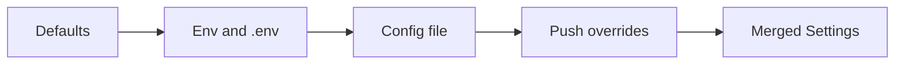

# Settings and environment configuration

This document describes the exact process for how backend settings and environment configuration work and should be used: what overrides what, where values come from, how to read and update them, and how this ties to one-button setup and readiness.

## Overview

Configuration is merged from four layers: **defaults** (from the `Settings` class), **environment** (`.env` and process env), **config file** (optional YAML or JSON; master over env), and **push overrides** (in-memory, applied at runtime). You read the merged result via the global `settings` proxy or `get_settings()`. You set values before process start in `.env` or a config file, or at runtime by pushing overrides via the admin API or by reloading the config file.

## Precedence (exact order)

Merge order (lowest to highest priority):

1. **Defaults** – Values defined on the `Settings` class in `backend/app/settings.py` (e.g. `database_url = "postgresql+asyncpg://..."`).
2. **Environment** – Variables from the process environment and from the `.env` file (loaded by Pydantic when building the env-backed dict). Env wins over defaults.
3. **Config file** – Optional YAML or JSON file. **The config file is the master over env**: any key present in the file overrides the same key from env. Keys must match `Settings` field names (snake_case, e.g. `database_url`, `gemini_api_key`).
4. **Push overrides** – In-memory overrides applied at runtime via `ConfigStore.update()`. They sit on top of file + env and persist until cleared or overwritten.

So: **push overrides > config file > env > defaults**.

## Sources and where they live

| Source | Location / trigger | Used when |
|--------|--------------------|-----------|
| **.env** | Backend dir: `backend/.env`. Copy from repo root `env.example` (or backend `.env.example` if present). | Loaded by Pydantic when building the initial env dict. |
| **Environment variables** | Shell or process env (e.g. `export DATABASE_URL=...`). | Same as .env; Pydantic reads them (case-insensitive; map to snake_case). |
| **Config file** | Path from env var **CONFIG_FILE**, or default **backend/config.yaml**. File can be YAML (`.yaml`/`.yml`) or JSON (`.json`). | Loaded at startup in `ConfigStore.load_initial()` and on `reload_from_file()`. |
| **Push** | In-memory only. Applied via `POST /v1/config` (body: JSON dict) or programmatic `get_config_store().update(overrides)`. | Takes effect immediately; no disk write unless you add one. |

**CONFIG_FILE** is the only env var that controls *where* the config file is; it does not change precedence. All other settings in the file override their env counterparts.

## Startup process (exact sequence)

1. On first import of `app.settings`, the module:
   - Resolves config file path: `os.environ.get("CONFIG_FILE")` or `backend/config.yaml`.
   - Creates `ConfigStore(Settings, config_file_path)` and calls `load_initial()`.
2. **load_initial()** (in `backend/app/config_store.py`):
   - Builds **env_dict** by instantiating `Settings()` (Pydantic loads `.env` and env vars) and calling `model_dump()`.
   - If config file path is set, reads the file to **file_dict** (YAML or JSON); missing/unreadable file yields `{}`.
   - Merges: `merged = {**env_dict, **file_dict, **_overrides}` (overrides initially empty).
   - Builds `Settings(**merged)` and stores it as `_current`.
3. The global **settings** object is a proxy that delegates attribute access to `_config_store.get_settings()`, so `settings.database_url` always returns the current value (including after push or reload).

**Infra that uses settings at import time** (e.g. `backend/app/infra/db/base.py` creating the DB engine) will see the result of this first load. Changing `database_url` via push or file reload does not recreate the DB engine; infra like DB/Redis may require a process restart for such changes to take effect.

## Reading settings

- **In application code**: `from app.settings import settings` and use `settings.database_url`, `settings.gemini_api_key`, etc. The proxy always returns the current merged value (so after a push or reload, the next attribute access sees it).
- **When you need a fresh snapshot** (e.g. after your own update or in request handlers): `from app.settings import get_settings` and call `get_settings()`. Prefer this when you must guarantee the latest value after a push/reload.
- **Caching**: Code that does `s = settings` and later uses `s.database_url` may see an outdated value if config was pushed/reloaded in between. For live values, use `get_settings()` each time or the proxy (`settings.attr`).

## Setting and updating config

- **Before process start**: Put values in **.env** (or env) and/or in the **config file**. Use the config file when you want it to be the master over env (e.g. shared team config in repo or deployed file).
- **Config file format**: Flat keys matching `Settings` fields. Example in `backend/config.yaml.example`. For lists (e.g. `cors_origins`), use YAML/JSON list syntax.
- **At runtime (push)**: Send `POST /v1/config` with a JSON body of overrides (e.g. `{"debug": true}`). Requires authentication (same as other admin routes). Overrides are merged in memory; validation errors leave the previous config unchanged.
- **Reload from file**: Send `POST /v1/config/reload` to re-read the config file and reapply saved push overrides. Use after editing the file on disk.
- **Clear push overrides**: Send `POST /v1/config/clear-overrides` to drop all in-memory overrides and reset to config file (master) + env.

**Secrets** (e.g. `secret_key`, API keys) can be set via env or config file; pushing them via a public API is a security concern, so prefer env or a protected config file for secrets.

## Env var naming

Pydantic Settings maps env vars to field names: **UPPER_SNAKE_CASE** in env becomes **snake_case** in `Settings`. Examples: `DATABASE_URL` -> `database_url`, `GEMINI_API_KEY` -> `gemini_api_key`. The config file uses **snake_case** keys (same as `Settings` fields), not env-style UPPER_SNAKE.

## One-button setup and readiness

- **One-button setup** (`backend/scripts/setup_env.sh`, `make setup`): Installs packages, starts postgres and redis via docker-compose, and can append **DATABASE_URL** to `.env` with port **5433** when the file does not already define it (because docker-compose maps postgres to 5433). So after `make setup`, the app can load settings that point at the running services.
- **Readiness check** (`backend/scripts/check_readiness.py`, `make ready`): Uses `get_settings()` to verify config load, packages, database (from `database_url`), and redis (from `redis_url`). Readiness reads the same merged settings (config file master over env, plus any push overrides).
- **Config file path**: If you use a config file, set **CONFIG_FILE** in `.env` or env before starting the server (and before running setup/readiness if they need to see the same config).

## Reference

- **Settings fields**: See `backend/app/settings.py` for the full `Settings` class (e.g. `app_name`, `database_url`, `redis_url`, `gemini_api_key`, `voiceprint_api_url`, `secret_key`, `cors_origins`, etc.).
- **Admin config endpoints** (require auth):
  - `POST /v1/config` – Push overrides (JSON body).
  - `POST /v1/config/reload` – Re-read config file and reapply overrides.
  - `POST /v1/config/clear-overrides` – Clear in-memory overrides.
